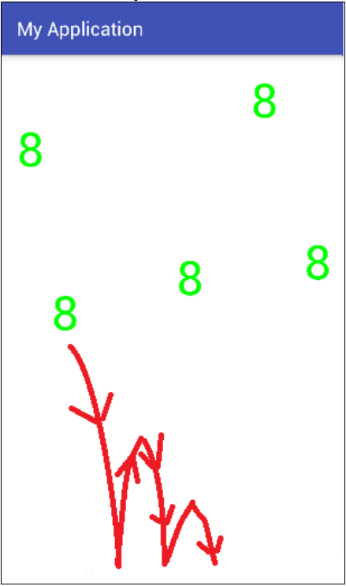
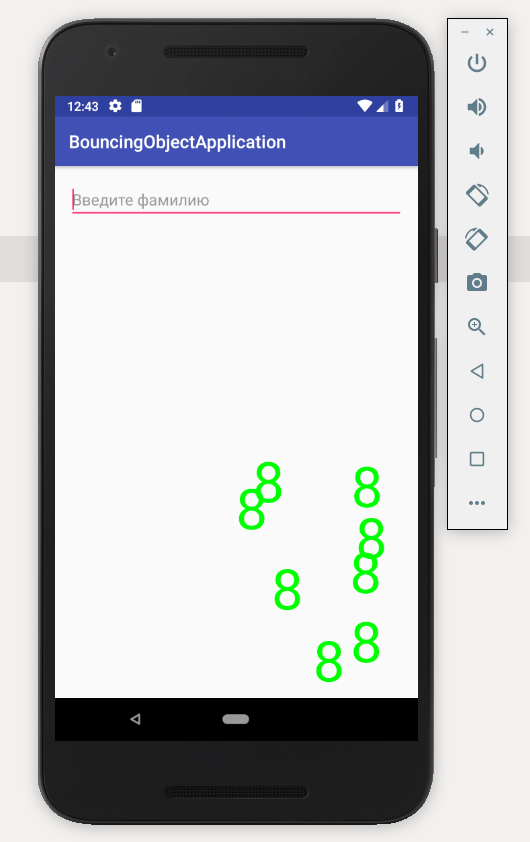
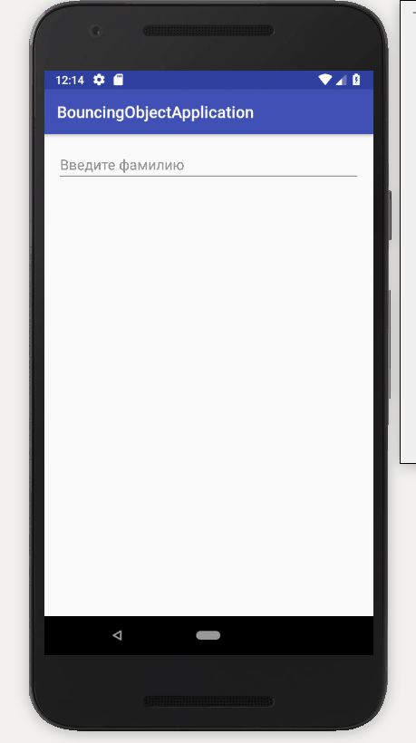
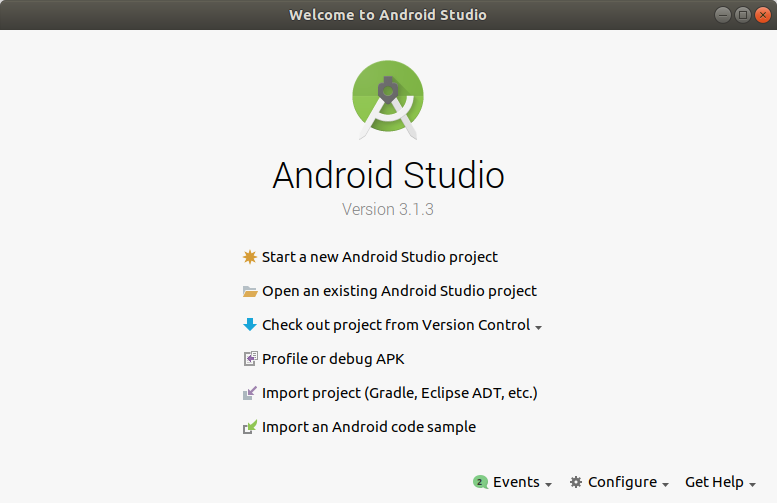
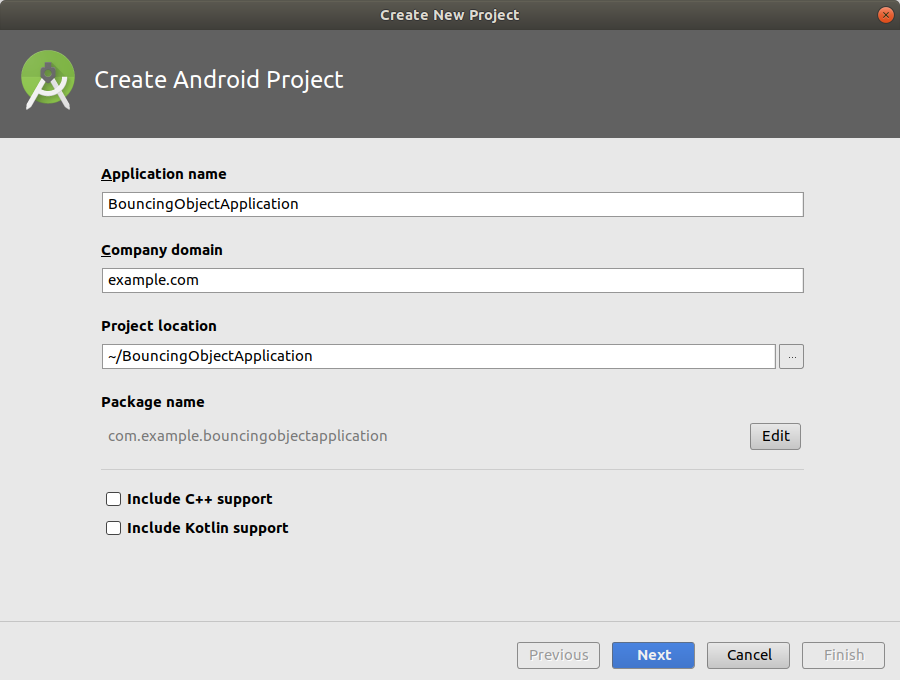
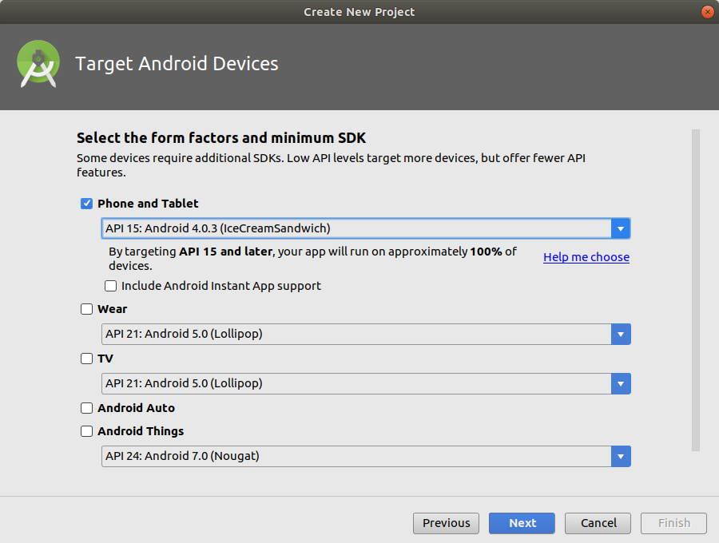
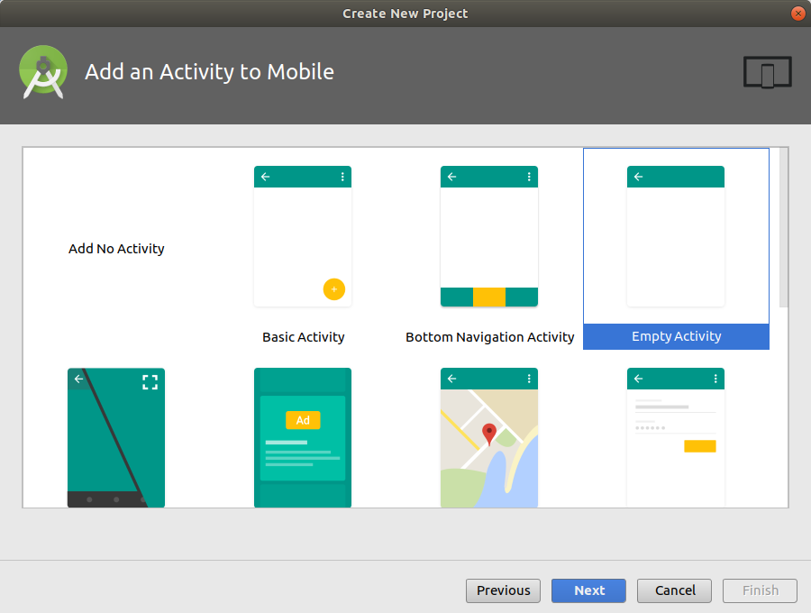
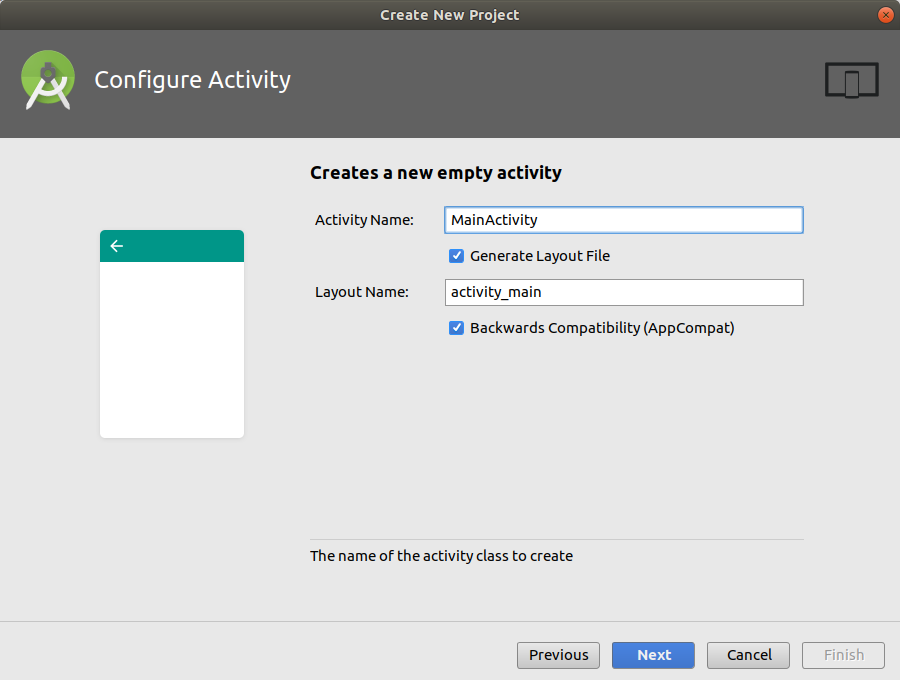
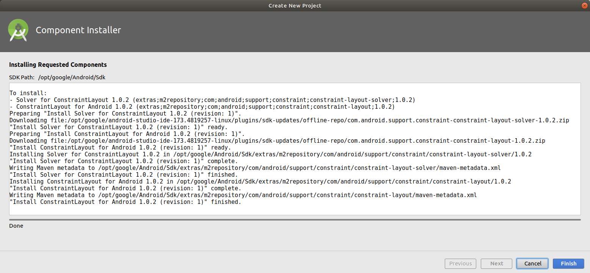

# Problem Statement

Реализуйте прыгающий <объект>. 

Начальная позиция появления объекта определяется нажатием пальца по экрану. 

Объект падает с ускорением вниз, отражаясь от нижней границы экрана, и с незначительным смешением вправо. 

С каждым разом высота отскока объекта уменьшается, и когда объект практически остановится, он пропадает с экрана. 

Объектов может быть несколько, поэтому каждый должен обрабатываться в отдельном потоке приложения. 

(<объект> - Буква Вашей фамилии, после каждого нажатия буква меняется на следующую, по окончанию Вы опять возвращаетесь на первую букву).

Для примера <объект> - цифра восемь, направление падения схематично показано красным.

# Screenshots

## Create New Project

