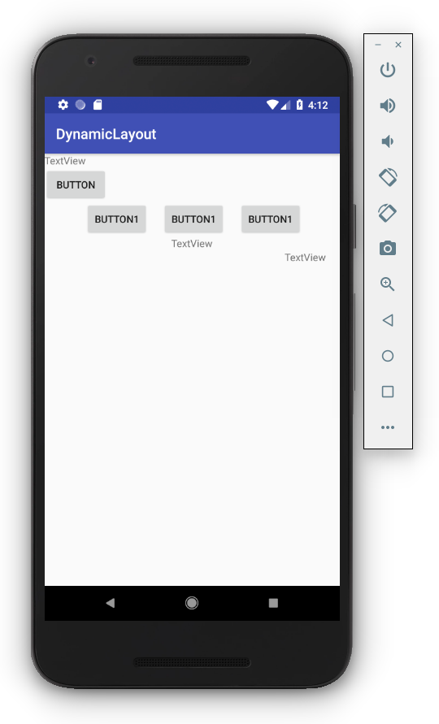

# Start a new Android Studio project

## Create Android Project

- Application name: Create User Interface Programmatically
- Company domain: example.com
- Project location: ~/AndroidStudioProjects/Create-User-Interface-Programmatically
- Package name: com.example.create_user_interface_programmatically
- [ ] Include C++ support
- [ ] Include Kotlin support

## Target Android Devices

- Phone and Tablet
  - API 15: Android 4.0.3 (IceCreamSandwich)
  - [ ] Include Android Instant App support

## Add an Activity to Mobile

- Add No Activity

# Run

# Links

- [LinearLayout.LayoutParams | Android Developers](https://developer.android.com/reference/android/widget/LinearLayout.LayoutParams.html)
- [LinearLayout and the Box Model](https://commonsware.com/Android/previews/linearlayout-and-the-box-model)
