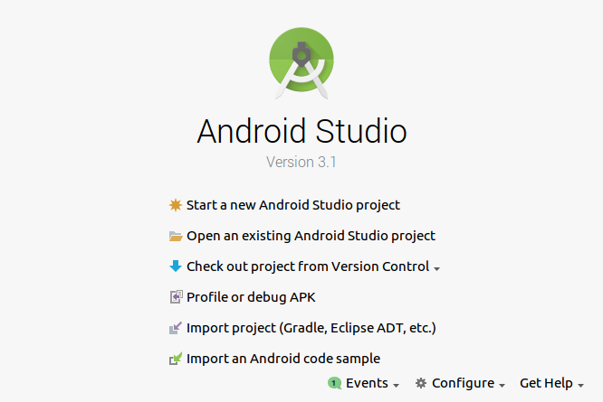
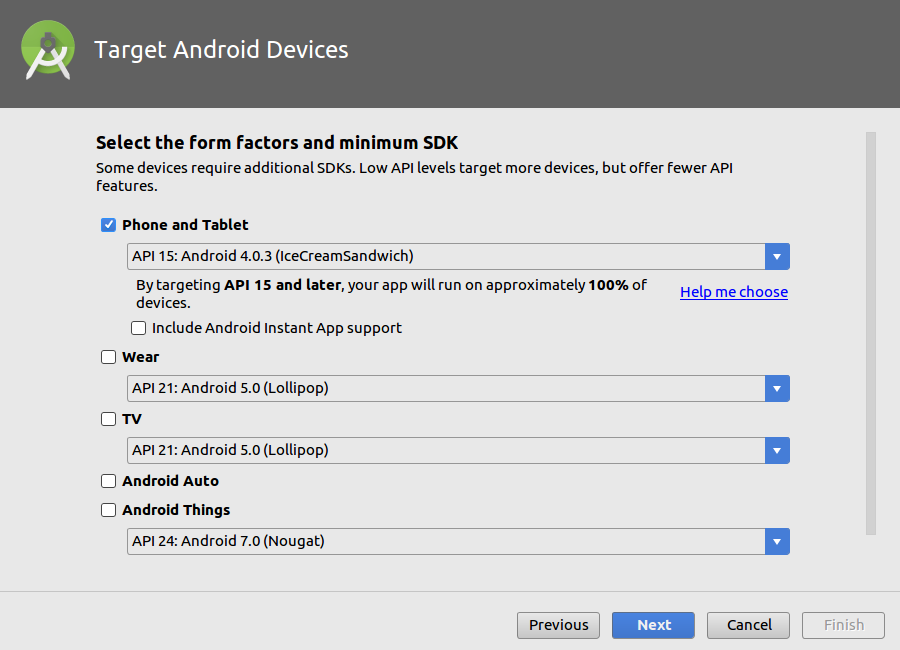

# Start a new Android Studio project

## Create Android Project

- Application name: Database List Create Read Delete Search
- Company domain: example.com
- Project location: ~/AndroidStudioProjects/Database-List-Create-Read-Delete-Search
- Package name: com.example.database_list_create_read_delete_search
- [ ] Include C++ support
- [ ] Include Kotlin support

## Target Android Devices

- Phone and Tablet
  - API 15: Android 4.0.3 (IceCreamSandwich)
  - [ ] Include Android Instant App support

## Add an Activity to Mobile

- Empty Activity

## Configure Activity

- Activity Name: MainActivity
- [:heavy_check_mark:] Generate Layout File
  - Layout Name: activity_main
- [:heavy_check_mark:] Backwards Compatibility (AppCompat)

# Run

# Links

- [Populating a ListView with a CursorAdapter · codepath/android_guides Wiki · GitHub](https://github.com/codepath/android_guides/wiki/Populating-a-ListView-with-a-CursorAdapter)
- [Android: CursorAdapter, ListView and CheckBox - Stack Overflow](https://stackoverflow.com/a/29211348)
- [java - Can&#39;t set multiple choice selection in ListView - Stack Overflow](https://stackoverflow.com/a/12344593)
- [Android Listview Example using CursorAdapter and SQLite database](http://www.mysamplecode.com/2012/07/android-listview-cursoradapter-sqlite.html)
- [tokudu - Android: Checkable Linear Layout](http://tokudu.com/2010/android-checkable-linear-layout/)

- [android - How to override the getItemId(int pos) method from CursorAdapter? - Stack Overflow](https://stackoverflow.com/a/10891343)

- [View On-Device Files with Device File Explorer | Android Studio](https://developer.android.com/studio/debug/device-file-explorer.html)

- [Saving Android Activity state using Save Instance State - Stack Overflow](https://stackoverflow.com/questions/151777/saving-android-activity-state-using-save-instance-state)
- [android - Data saving during Activity life cycle - Stack Overflow](https://stackoverflow.com/a/4553755)
- [The Activity Lifecycle | Android Developers](https://developer.android.com/guide/components/activities/activity-lifecycle.html)

- [Send Emulator Console Commands | Android Studio](https://developer.android.com/studio/run/emulator-console.html)
- [NixMash : How To Kill an Offline Android Emulator in Linux](https://nixmash.com/post/how-to-kill-an-offline-android-emulator-in-linux)

- [Checking if a string is empty or null in Java - Stack Overflow](https://stackoverflow.com/a/14721418)
- [Java HashMap Examples - Dot Net Perls](https://www.dotnetperls.com/hashmap-java)

