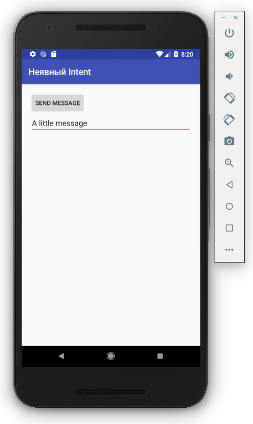

# Start a new Android Studio project

## Create Android Project

- Application name: Implicit Intent With Action
- Company domain: example.com
- Project location: ~/AndroidStudioProjects/Implicit-Intent-With-Action
- Package name: com.example.implicit_intent_with_action
- [ ] Include C++ support
- [ ] Include Kotlin support

## Target Android Devices

- Phone and Tablet
  - API 15: Android 4.0.3 (IceCreamSandwich)
  - [ ] Include Android Instant App support

## Add an Activity to Mobile

- Add No Activity

# Run

