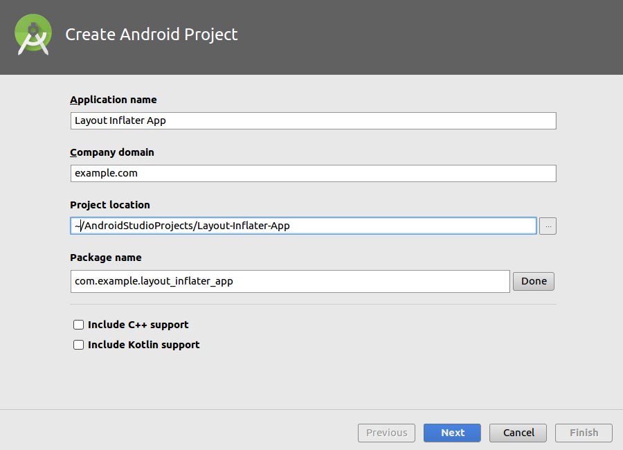
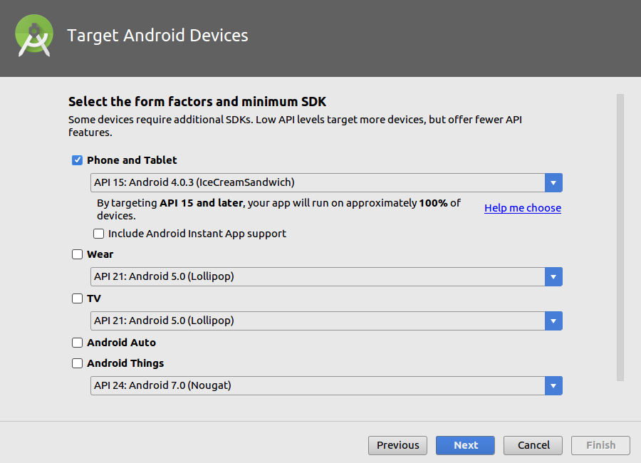
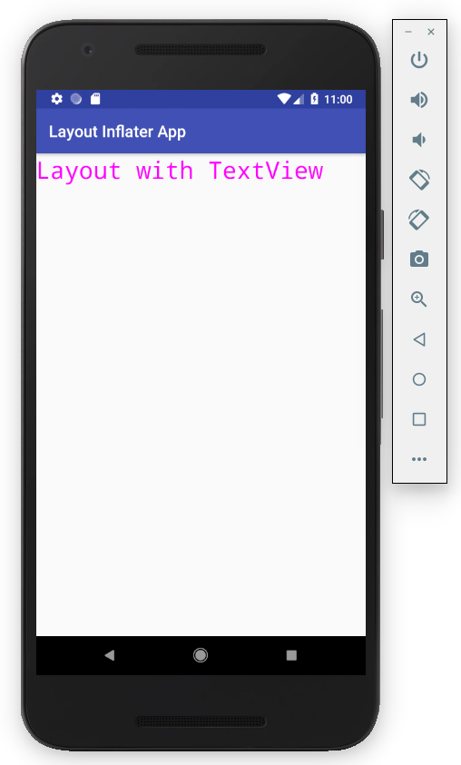
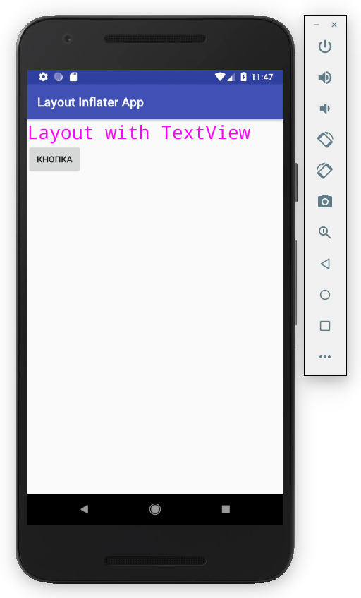
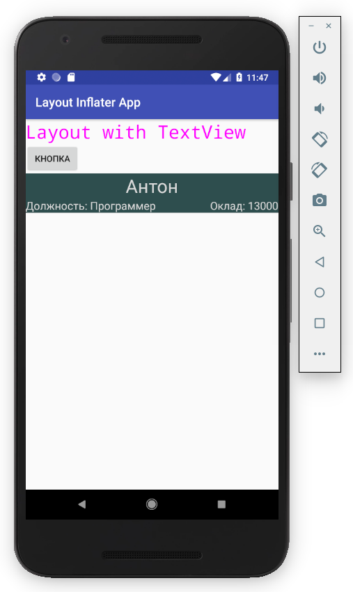
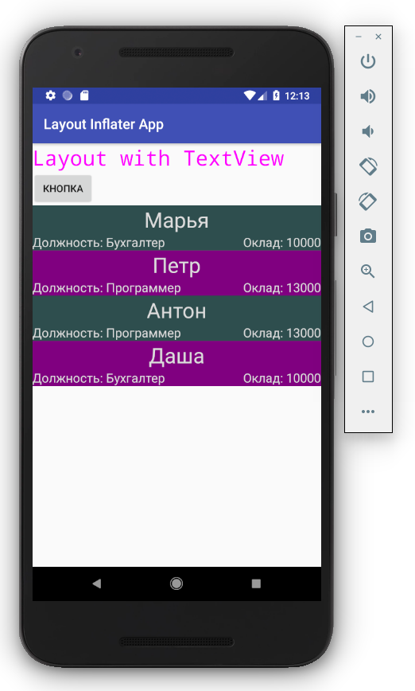

# Start a new Android Studio project

## Create Android Project

- Application name: Layout Inflater App
- Company domain: example.com
- Project location: ~/AndroidStudioProjects/Layout-Inflater-App
- Package name: com.example.layout_inflater_app
- [ ] Include C++ support
- [ ] Include Kotlin support

## Target Android Devices

- Phone and Tablet
  - API 15: Android 4.0.3 (IceCreamSandwich)
  - [ ] Include Android Instant App support

## Add an Activity to Mobile

- Add No Activity

# Run

