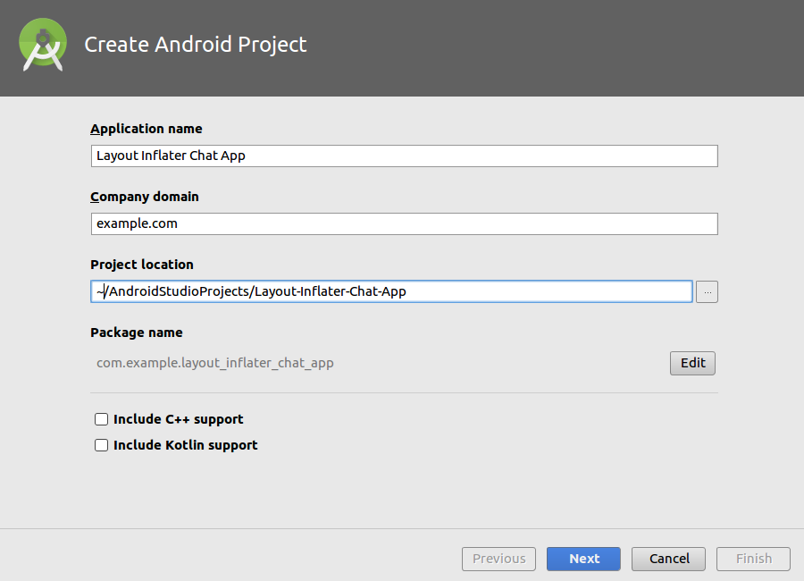
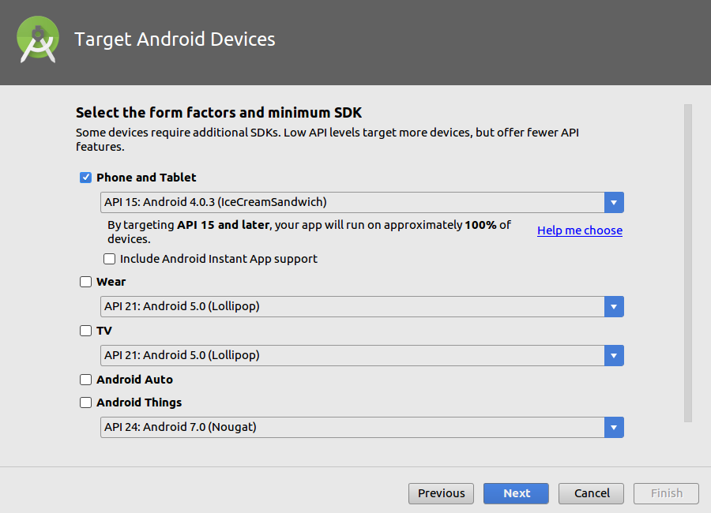
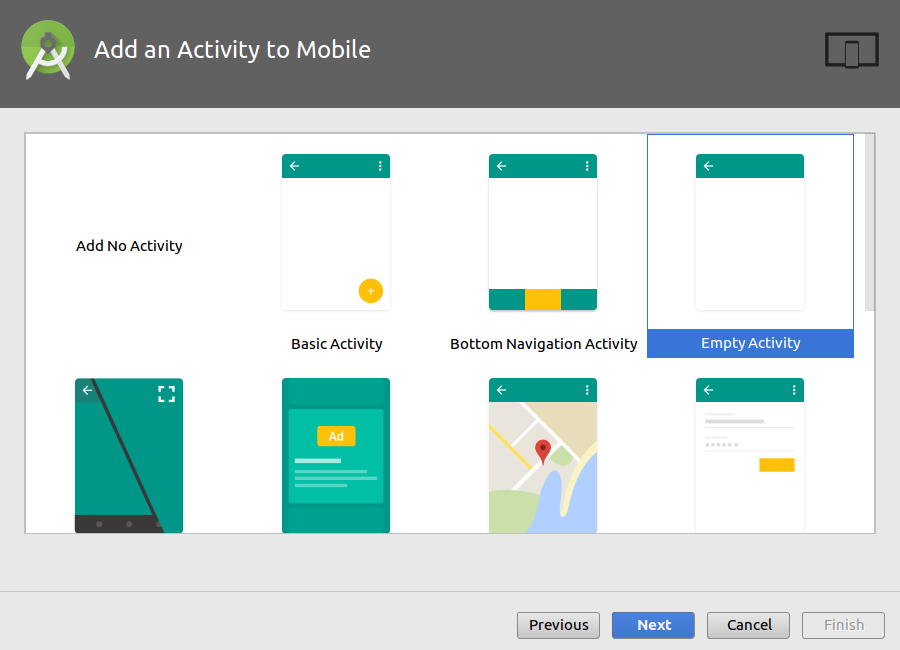
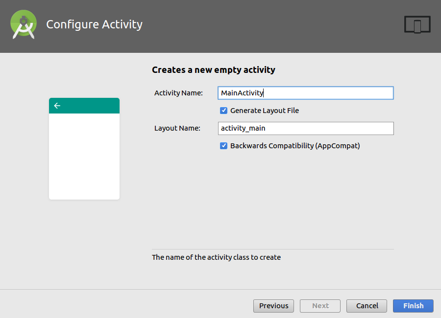
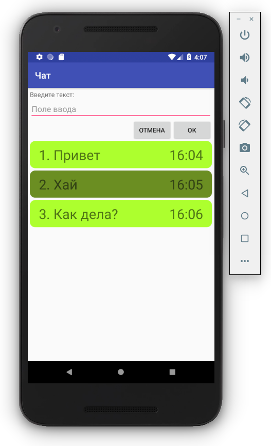

# Start a new Android Studio project

## Create Android Project

- Application name: Layout Inflater Chat App
- Company domain: example.com
- Project location: ~/AndroidStudioProjects/Layout-Inflater-Chat-App
- Package name: com.example.layout_inflater_chat_app
- [ ] Include C++ support
- [ ] Include Kotlin support

## Target Android Devices

- Phone and Tablet
  - API 15: Android 4.0.3 (IceCreamSandwich)
  - [ ] Include Android Instant App support

## Add an Activity to Mobile

- Empty Activity

## Configure Activity

- Activity Name: MainActivity
- [:heavy_check_mark:] Generate Layout File
  - Layout Name: activity_main
- [:heavy_check_mark:] Backwards Compatibility (AppCompat)

# Run

# Links

- [Relative Layout | Android Developers](https://developer.android.com/guide/topics/ui/layout/relative.html)
- [Add Rounded Corners to Views and Layouts Android - GadgetSaint](http://www.gadgetsaint.com/tips/rounded-corners-views-layouts-android/)

