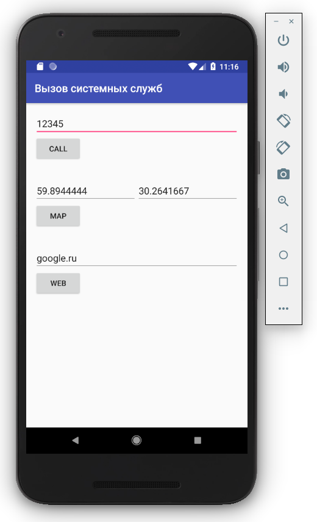

# Start a new Android Studio project

## Create Android Project

- Application name: Show URI
- Company domain: example.com
- Project location: ~/AndroidStudioProjects/Show-URI
- Package name: com.example.show_uri
- [ ] Include C++ support
- [ ] Include Kotlin support

## Target Android Devices

- Phone and Tablet
  - API 15: Android 4.0.3 (IceCreamSandwich)
  - [ ] Include Android Instant App support

## Add an Activity to Mobile

- Add No Activity

# Run

# Links

- [Uri | Android Developers](https://developer.android.com/reference/android/net/Uri.html)
- [Services | Android Developers](https://developer.android.com/guide/components/services.html)
- [System Services](https://commonsware.com/Android/previews/system-services)
- [Google Android: системные компоненты и сетевые коммуникации + СD](https://books.google.kz/books?id=ubHBVpcU8kQC)

